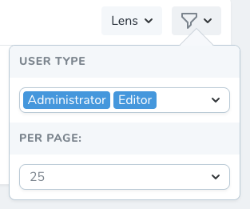

# Nova Multiselect Filter

Provides capability of selecting multiple values with Nova Resource filter.



## Installation

You can install the package in to a Laravel app that uses [Nova](https://nova.laravel.com) via composer:

```bash
composer require rcknr/nova-multiselect-filter
```

## Usage

Use `MultiselectFilter` class instead of `Filter`:

```php
use rcknr\Nova\Filters\MultiselectFilter;

class UserType extends MultiselectFilter
{
  public function __construct()
  {
        // define badge / text color
        $this->colors([
            'Administrator' => '#abc', // badge only, text color depends on badge
            'Editor' => [
                'color' => '#fff',
                'background' => '#ffe309'
        ]]);
        
        // show searchbar to filter select options
        $this->showSearch();
        
        // hide color dots on select list
        $this->hideDots();
  }
 
  public function apply(Request $request, $query, $value)
  {
      return $query->whereIn('user_role', $value);
  }

  public function options(Request $request)
  {
      return [
          'Administrator' => 'admin',
          'Editor' => 'editor',
      ];
  }
}
```
